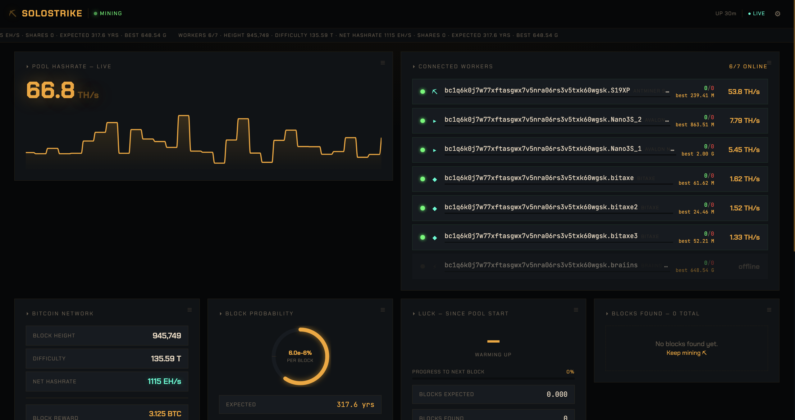
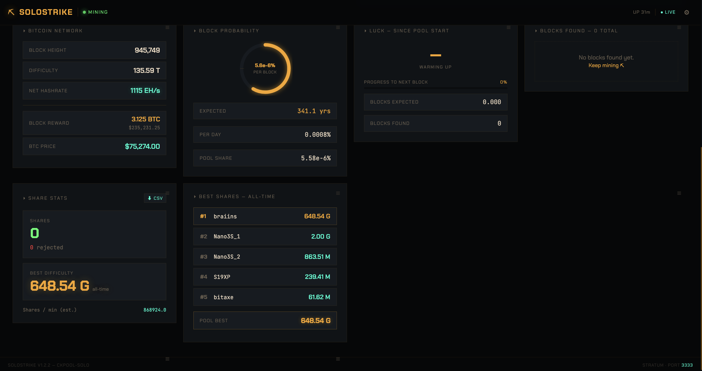

<div align="center">

# ⛏ SoloStrike

**Zero-fee solo Bitcoin mining pool for your Umbrel node**

*Self-hosted. Self-custodied. Airgap-capable.*

[](LICENSE)
[](https://umbrel.com)
[](https://bitbucket.org/ckolivas/ckpool-solo/)
[](#supported-platforms)

</div>

-----

## Why SoloStrike

In a **pooled mining** setup, thousands of miners split every block, and the pool operator skims a percentage. In **solo mining**, you don’t share. Every block your miners find pays the entire reward — subsidy plus every satoshi of fees — directly to your address.

SoloStrike gives you solo mining on your own Umbrel, with:

- **0% pool fees** — forever, no catch. ckpool-solo constructs the coinbase transaction to pay 100% to your address.
- **Your node, your rules** — connects directly to your Umbrel’s Bitcoin Core via the injected RPC credentials. No external dependencies for the mining core path.
- **Private Mode** — one toggle and the entire app goes airgapped. No mempool.space calls, no price APIs, no outbound traffic. Your mining activity is yours alone.
- **Fleet-grade observability** — real-time hashrate waveform, per-worker stats, historical leaderboards, block probability odds, Prometheus metrics for Grafana, webhook notifications, 90-day snapshots.
- **Home-screen widget** — a native umbrelOS widget showing pool hashrate, workers online, blocks found, and your best difficulty. Pin it to glance without opening the app.
- **Progressive Web App** — “Add to Home Screen” on iOS/Android gives you a real standalone app experience.

Every share is a lottery ticket. Every block, if it comes, is yours entirely.

-----

## Screenshots


*Real-time Deep Mine dashboard: live pool hashrate, closest calls leaderboard, fleet status, block probability.*


*Per-worker insights: hashrate, best diff, last share, automatic miner-type detection, clickable IP to each miner’s web UI.*

-----

## Feature Index

### 🔒 Privacy & Sovereignty

- **Private Mode** — airgapped operation, all outbound APIs blocked when enabled
- **ZMQ status indicator** — see at a glance whether Bitcoin Core’s block broadcasts are reaching the pool
- **Coinbase branding** — every block your pool finds is tagged `/SoloStrike on Umbrel/` on-chain forever

### 📊 Real-Time Observability

- **Live hashrate waveform** with 24h history, 7-day trends, axis labels, and peak tracking
- **Sticky header cluster** — pool status, 29-metric scrolling ticker, latest block, sync warnings, ZMQ indicator
- **Per-worker live stats** — hashrate, difficulty, last-share timestamp, status, best-share tracking
- **Automatic miner-type detection** — BitAxe (Gamma/Supra/Ultra), NerdQaxe++, Antminer S19/S21 variants, Avalon Nano 3S / Avalon Q, Whatsminer, Braiins rentals
- **Bitcoin Node panel** — Core version, peer count, relay fee, mempool size

### 🎯 Historical Intelligence

- **Closest Calls leaderboard** — top 10 highest-difficulty shares ever submitted across your fleet
- **Daily hashrate snapshots** — 90 days of per-day avg / peak history
- **Block probability engine** — daily, weekly, monthly odds + expected time-to-block
- **Luck gauge & difficulty retarget countdown**
- **Top Pool Finders leaderboard** — Recent network blocks feed with solo-winner highlighting

### 🖥️ Native umbrelOS Integration

- **Home-screen widget** (v1.5.0+) — 4-stat widget refreshing every 10 seconds
- **Progressive Web App** (v1.5.1+) — Add to Home Screen on iOS/Android gives you a standalone app icon, splash, and full-screen chrome
- **Guided onboarding wizard** (v1.5.2+) — 5-step first-run setup with QR codes for stratum URLs

### ⚙️ Customization

- **Drag-and-drop card reordering** — layout persists per-device
- **Mobile-first responsive layout** — 1/2/4 columns based on screen size
- **Worker aliases** — rename miners to friendly names for the dashboard
- **Customizable top strip & ticker** — pick from 29 metrics across 6 categories
- **7-currency BTC price** — USD, EUR, GBP, CAD, CHF, AUD, JPY
- **Minimal Mode** — strip the UI down to just the essentials

### 🔌 Integrations

- **Prometheus `/metrics`** — scrape into Grafana, Home Assistant, or any TSDB
- **Webhooks** — POST block/worker events to Discord, ntfy.sh, Home Assistant, Telegram, custom endpoints
- **Public read-only API** — expose pool stats externally (optional)
- **CSV export** — workers and found blocks
- **Dual stratum ports** — 3333 for ASICs, 3334 for hobby miners with lower starting difficulty

### 💎 Block Celebration

- Confetti explosion animation when your pool finds a block
- Direct mempool.space link
- Permanent block history feed

-----

## Differentiators vs. other Umbrel solo pools

|Feature                             |SoloStrike |Public Pool    |Bassin     |
|------------------------------------|:---------:|:-------------:|:---------:|
|Engine                              |ckpool-solo|NestJS (custom)|ckpool-solo|
|Pool fee                            |0%         |0%             |0%         |
|Private Mode (airgapped)            |✅          |❌              |❌          |
|Home-screen widget                  |✅          |✅              |✅          |
|Closest Calls historical leaderboard|✅          |❌              |❌          |
|90-day daily snapshots              |✅          |❌              |❌          |
|Automatic miner-type detection      |✅          |❌              |❌          |
|Webhooks                            |✅          |❌              |❌          |
|Prometheus metrics                  |✅          |❌              |❌          |
|Branded coinbase tag on block       |✅          |✅              |❌          |
|Progressive Web App                 |✅          |❌              |❌          |
|Dual stratum ports (ASIC + hobby)   |✅          |❌              |❌          |

SoloStrike is for people who want the ckpool-solo engine *and* a modern operations layer on top — not just a hashrate counter.

-----

## Installation

### 1. Add the community app store to Umbrel

1. Open **App Store** on your Umbrel
1. Tap the **⋯** menu (top right) → **Community App Stores**
1. Add:
   
   ```
   https://github.com/danhaus93-ops/solostrike-umbrel
   ```
1. Tap **Add**

### 2. Install SoloStrike

1. Open the SoloStrike community store
1. Tap **SoloStrike → Install**
1. Umbrel pulls the multi-arch Docker images (amd64 or arm64, ~1-2 min)

### 3. First-run setup (v1.5.2+)

The onboarding wizard walks you through 5 steps:

1. **Welcome** — what SoloStrike does
1. **Payout address** — enter your Bitcoin address (`bc1…`, `1…`, or `3…`)
1. **Connect miners** — scannable QR codes for both stratum ports
1. **Verification** — wizard detects your first worker as it connects
1. **Tour** — overview of the dashboard’s headline features

### 4. Find your Umbrel’s LAN IP

Most miners need a raw IP, not `umbrel.local`.

- **Umbrel UI**: Settings → local IP shown at top (usually `192.168.x.x`)
- **Router**: log into admin page, look for “umbrel” in connected devices
- **SSH**: `ssh umbrel@umbrel.local` → `hostname -I`

### 5. Point your miners

|Setting        |Value                                                    |
|---------------|---------------------------------------------------------|
|**Stratum URL**|`stratum+tcp://<YOUR-UMBREL-IP>`                         |
|**Port**       |`3333` (ASICs) or `3334` (BitAxe, NerdQaxe, hobby miners)|
|**Username**   |`<your-btc-address>.<worker-name>`                       |
|**Password**   |`x`                                                      |

Example for a BitAxe (AxeOS):

```
Stratum URL:  192.168.50.228
Stratum Port: 3334
Stratum User: bc1q6k0j7w77xftasgwx7v5nra06rs3v5txk60wgsk.bitaxe1
Password:     x
```

Within 30-60 seconds workers appear on the dashboard and shares start flowing.

> ⚠️ **Don’t use `umbrel.local` in miner configs.** Most ASICs don’t resolve mDNS reliably. Use the raw LAN IP.

> 💡 **Why your Bitcoin address as username?** ckpool-solo uses the username field as the payout address in “any valid BTC address” mode. The `.workername` suffix shows up as a separate labeled worker on the dashboard.

-----

## Architecture

```
┌─────────────────────────────┐
│  Your ASICs / BitAxes /     │
│  NerdQaxes / Whatsminers    │
└─────────┬───────────────────┘
          │ Stratum V1
          ▼ 3333 (ASIC) / 3334 (hobby)
┌─────────────────────────────┐
│       ckpool-solo           │  ← ghcr.io/getumbrel/docker-ckpool-solo
│    (mining engine)          │     (multi-arch, pinned to commit)
└────┬───────────────┬────────┘
     │ status files  │ RPC + ZMQ
     ▼               ▼
┌──────────┐  ┌──────────────────┐
│   API    │  │  Bitcoin Core    │  ← Umbrel-managed
│ (Node)   │  │  (Umbrel app)    │     via injected env vars
│ REST +   │  │  Block template  │
│ metrics  │  │  submission      │
└────┬─────┘  └──────────────────┘
     │ :3001
     ├────────────────┐
     │                │
     ▼                ▼
┌──────────┐    ┌──────────────┐
│ Widget   │    │  Dashboard   │
│ Server   │    │  UI (React)  │
│ :3000    │    │  nginx :80   │
└──────────┘    └──────────────┘
     │                │
     ▼                ▼
 umbrelOS        Port 1234 via
 home screen     Umbrel app_proxy
 widget          (auth required)
```

Five containers orchestrated by Umbrel:

- **`ckpool`** — Umbrel’s multi-arch ckpool-solo image. Handles stratum connections, writes live stats to `/var/log/ckpool/`, submits blocks via Bitcoin Core RPC.
- **`api`** — Node.js status poller + REST API on `:3001`. Reads ckpool’s status files, exposes `/api/state`, `/api/public/summary`, `/metrics`.
- **`ui`** — React SPA served by nginx, reverse-proxied through Umbrel’s `app_proxy`.
- **`widget-server`** — Tiny Bun service on `:3000` serving the 4-stat widget JSON for umbrelOS.
- **`app_proxy`** — Umbrel-injected auth/port routing layer.

Cross-container communication is over Umbrel’s Docker network, not exposed to LAN except on the two stratum ports.

-----

## Ports

|Port|Service                                     |Exposure                            |
|----|--------------------------------------------|------------------------------------|
|1234|Dashboard UI                                |Via Umbrel app_proxy (auth required)|
|3333|Stratum V1 — ASICs                          |Open on LAN                         |
|3334|Stratum V1 — hobby miners (lower start diff)|Open on LAN                         |
|3000|Widget server                               |Internal only (umbrelOS reads it)   |
|3001|API server                                  |Internal only                       |

-----

## Supported Platforms

- **umbrelOS on Umbrel Home** — primary target, fully tested (amd64)
- **umbrelOS on Raspberry Pi 4/5** — native arm64 Docker images, CI-tested
- **umbrelOS on Linux VM** — works, runs on amd64 natively
- **Any umbrelOS running 1.4+**

Docker images are multi-arch (`linux/amd64` + `linux/arm64`). CI builds on native arm64 GitHub runners — no qemu emulation.

### Resource Footprint

- **CPU**: ckpool ~2-5% on a single core while mining. Widget + API + UI negligible.
- **RAM**: ~150 MB total across all 5 containers at idle. ~250 MB under load with a 100+ worker fleet.
- **Disk**: ~500 MB for images. ~1-5 MB/day for logs + daily snapshots.

-----

## Supported Miners

Anything that speaks Stratum V1 works out of the box:

|Miner                       |Protocol  |Status  |
|----------------------------|----------|--------|
|Antminer S9 / S19 / S21 / L9|Stratum V1|✅       |
|BitAxe Gamma / Supra / Ultra|Stratum V1|✅ Tested|
|NerdMiner v2                |Stratum V1|✅       |
|NerdQaxe++                  |Stratum V1|✅ Tested|
|Avalon Nano 3 / 3S / Q      |Stratum V1|✅       |
|Whatsminer (M3x, M5x, M6x)  |Stratum V1|✅       |
|Braiins rentals             |Stratum V1|✅       |
|cgminer / bfgminer          |Stratum V1|✅       |

Automatic detection identifies the miner type from share patterns and displays it in the Workers card — no manual tagging.

-----

## Security & Privacy

### What SoloStrike does NOT do

- ❌ **Does not phone home.** No telemetry, no analytics, no crash reporting.
- ❌ **Does not touch your keys.** SoloStrike only stores a Bitcoin *address* (public). There is nowhere to put a private key, and the app does not ask.
- ❌ **Does not expose the dashboard to the internet** by default. Umbrel’s `app_proxy` gates it behind your Umbrel password.

### Private Mode

When enabled (Settings → Privacy), SoloStrike blocks ALL outbound API calls:

- ❌ mempool.space (block/fee data)
- ❌ BTC price APIs (all 7 currencies)
- ❌ Network difficulty lookups

The dashboard continues to run fully on local data from your own Bitcoin Core. Mempool panel disables, price ticker hides, everything else works. Ideal for users running Umbrel on an airgapped or Tor-only network.

### Data Storage

All user data lives in:

```
${APP_DATA_DIR}/data/
├── config/          → user prefs, payout address, webhook URLs
├── ckpool/
│   ├── config/      → ckpool.conf generated at start
│   └── logs/        → share and block logs (90 days)
└── snapshots/       → daily rollups
```

Data persists across app updates. Updating or restarting the app does not clear worker aliases, snapshots, or Closest Calls history.

### Coinbase Tag

Every block your pool finds is tagged `/SoloStrike on Umbrel/` in the coinbase transaction. This is a cosmetic on-chain signature — it does NOT affect payout (100% goes to your address) and cannot be disabled without rebuilding the Docker image.

-----

## Bitcoin Core Connection

SoloStrike auto-connects to your Umbrel Bitcoin Core via Umbrel’s injected environment variables — zero manual RPC config:

- `APP_BITCOIN_NODE_IP` (typically `10.21.21.8`)
- `APP_BITCOIN_RPC_PORT` (`8332`)
- `APP_BITCOIN_RPC_USER` (Umbrel-managed)
- `APP_BITCOIN_RPC_PASS` (Umbrel-managed, auto-generated)
- `APP_BITCOIN_ZMQ_HASHBLOCK_PORT` (`28334`)

Your Bitcoin Core must be fully synced before ckpool can issue valid work to miners.

-----

## FAQ

**Q: What’s the catch?**
No catch. Solo mining is a variance game. With 1 TH/s you statistically find a block once every ~800 years. With 100 TH/s it’s every 8 years. Could happen tomorrow, could happen never. That’s why it’s called a lottery ticket.

**Q: Is this Stratum V2?**
No — Stratum V1, which is what every existing ASIC and hobby miner speaks out of the box. SV2 support would require miner firmware changes or an SRI translator proxy. On our roadmap for v2.0.0, not before.

**Q: What happens when I find a block?**
ckpool constructs a coinbase paying 100% of the block subsidy (currently 3.125 BTC) + all fees to your address. The block is submitted to Bitcoin Core, propagates to the network, and appears in your wallet as an unconfirmed incoming transaction within seconds. 100 confirmations to spend.

**Q: Can I change my payout address later?**
Yes — tap the ⚙ gear in the dashboard → Settings → change address → save. Takes effect within 5 seconds. Any subsequent block pays to the new address. Already-found blocks are locked to whatever address you had at mining time (that’s how coinbase txs work).

**Q: Does the dashboard work over Tailscale / WireGuard / Tor?**
Yes. The dashboard is a standard web app on port 1234 via Umbrel’s app_proxy. Access it over any Umbrel-supported remote access method. Miners still need to connect to ports 3333/3334 on your LAN — TLS stratum is on the roadmap for v1.5.3.

**Q: Why do share counts look weirdly high?**
ckpool reports difficulty-weighted share values, not raw share counts. A BitAxe submitting “115 shares” at diff 256 = 29,440 difficulty-weighted shares. Both are correct — one is proof-of-work volume, the other is submission count. Dashboard shows the former.

**Q: How do I enable Private Mode?**
⚙ gear → Privacy → toggle “Private Mode.” Browser reloads, outbound calls stop. Toggle back anytime.

**Q: Can I export my data?**
Yes. Each major card (Workers, Blocks Found) has a CSV export button. For automated export, use the Prometheus `/metrics` endpoint.

**Q: Does this work with Braiins rentals?**
Yes. Point the rental dashboard at your stratum URL and port. Rented hashrate counts the same as your own.

-----

## Troubleshooting

### Miners won’t connect

Check port 3333 (or 3334) is reachable from the miner’s LAN:

```bash
ssh umbrel@<YOUR-UMBREL-IP>
timeout 2 bash -c '</dev/tcp/<YOUR-UMBREL-IP>/3333' && echo "OPEN" || echo "CLOSED"
```

If closed:

- Miner may be on a guest network / different VLAN than Umbrel
- Router may have “AP Isolation” enabled — disable for the Umbrel’s VLAN

### Dashboard shows 0 workers but the API is healthy

Restart the API container to force a re-read of ckpool status files:

```bash
sudo docker restart danhaus93-solostrike_api_1
```

Wait 15 seconds, refresh. If workers are submitting shares, they’ll appear.

### ckpool logs show “No bitcoinds active”

ckpool can’t reach Bitcoin Core. Check the logs:

```bash
sudo docker logs danhaus93-solostrike_ckpool_1 --tail 30
```

If you see `Failed to connect socket to 10.21.21.8:8332` — Bitcoin Core may be restarting or not yet reachable. Wait 30 seconds. If persistent, restart from Umbrel UI.

### Shares are being rejected

Usually Bitcoin Core is still syncing — ckpool won’t issue valid work until the node is at chain tip. Wait for initial sync to complete. Secondary cause: invalid payout address. Double-check the address in Settings.

### App stuck “updating” or “restarting” forever

The docker-compose.yml in `/home/umbrel/umbrel/app-data/danhaus93-solostrike/` may have become corrupted. SSH in and check:

```bash
head -5 /home/umbrel/umbrel/app-data/danhaus93-solostrike/docker-compose.yml
```

Line 1 should be `version: "3.7"`. If it’s `manifestVersion:` or anything else, file an issue — something in the update pipeline corrupted it.

### Full log inspection

```bash
sudo docker logs -f danhaus93-solostrike_ckpool_1          # mining engine
sudo docker logs -f danhaus93-solostrike_api_1             # API + poller
sudo docker logs -f danhaus93-solostrike_ui_1              # dashboard nginx
sudo docker logs -f danhaus93-solostrike_widget-server_1   # home-screen widget
```

-----

## Updates

When new versions ship, Umbrel prompts you to update from the App Store. All user data (payout address, worker aliases, snapshots, Closest Calls history, webhook config) persists automatically — it’s stored in `${APP_DATA_DIR}/data/` which is mounted as a volume and survives image upgrades.

Version history lives in <CHANGELOG.md>.

-----

## Reproducible Builds

All Docker images are built in public GitHub Actions CI from the source in this repo. To verify any published image:

```bash
# Inspect the multi-arch manifest and digests
docker buildx imagetools inspect ghcr.io/danhaus93-ops/solostrike-ui:latest
docker buildx imagetools inspect ghcr.io/danhaus93-ops/solostrike-api:latest
docker buildx imagetools inspect ghcr.io/danhaus93-ops/solostrike-widget-server:latest
```

Each published tag corresponds to a commit SHA in this repo. CI runs on native amd64 + arm64 GitHub runners (no qemu emulation).

-----

## Development

### Local build

```bash
git clone https://github.com/danhaus93-ops/solostrike-umbrel
cd solostrike-umbrel/danhaus93-solostrike

# UI (React + Vite)
cd ui && npm install && npm run dev

# API (Node.js)
cd ../api && npm install && node server.js

# Widget server (Bun)
cd ../../widget-server && bun install && bun run server.ts
```

### Docker build

```bash
docker buildx build --platform linux/amd64,linux/arm64 -t solostrike-ui danhaus93-solostrike/ui/
```

See `.github/workflows/build.yml` for the exact CI pipeline.

-----

## Roadmap

**v1.5.x — Phase 2 polish** (mostly shipped)

- ✅ umbrelOS home-screen widget
- ✅ PWA “Add to Home Screen”
- ✅ Branded coinbase tag
- ✅ 5-step onboarding wizard with QR codes
- ⏳ TLS stratum on port 4333 (v1.5.3)

**v1.6.x-v1.9.x — Phase 3 features**

- Profitability calculator (power cost → break-even math)
- Smart alerts (worker offline → push notification)
- AxeOS temperature integration
- Enhanced block celebration

**v2.0.0 — Phase 4 / App Store submission**

- DATUM protocol support
- Stratum V2 translator
- Miner optimization advisor
- Official Umbrel App Store submission

-----

## Credits

- **[ckpool-solo](https://bitbucket.org/ckolivas/ckpool-solo/)** by Con Kolivas — the mining engine
- **[docker-ckpool-solo](https://github.com/getumbrel/docker-ckpool-solo)** by Umbrel — multi-arch prebuilt image
- **[mempool.space](https://mempool.space)** — block explorer integration
- **[Umbrel](https://umbrel.com)** — the home server OS that makes self-hosting this possible

-----

## License

MIT — use it, fork it, remix it. Just don’t roll it into a custodial pool and charge fees. That’s the opposite of the point.

-----

## Disclaimer

Solo mining is a statistical game. You may mine for months or years without finding a block. You may find one tomorrow. Only mine with equipment and electricity you can afford to run without a guaranteed return.

SoloStrike provides the infrastructure. The lottery ticket is yours.

-----

<div align="center">

## ⚡ Support Development

If SoloStrike helps you solo mine, a tip keeps the dev caffeine flowing:

**`bc1q6k0j7w77xftasgwx7v5nra06rs3v5txk60wgsk`**

*Lightning address coming soon ⚡*

**⛏ Solo mine responsibly. Keep your keys. Stack your sats. 💎**

*Find a block? Send a sat.*

</div>
