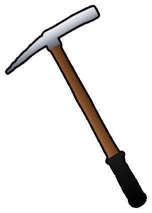
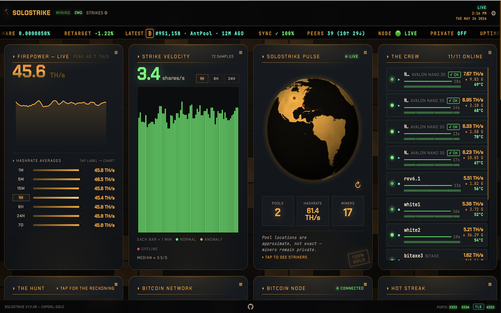
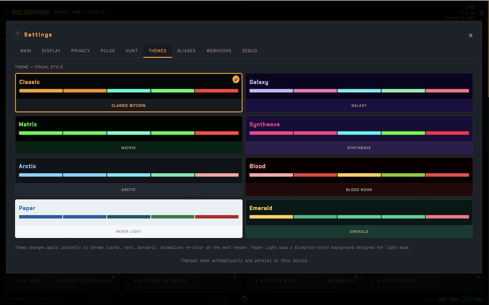

https://github.com/user-attachments/assets/45de22af-e71c-4531-86a3-8ed1bc74a48f
<div align="center">



# SoloStrike #

**Zero-fee solo Bitcoin mining pool for your Umbrel node**

*Self-hosted. Self-custodied. Airgap-capable.*

[](LICENSE)
[](https://umbrel.com)
[](https://bitbucket.org/ckolivas/ckpool-solo/)
[](#supported-platforms)

</div>

-----

## Why SoloStrike

In **pooled mining**, thousands of miners split every block and the operator skims a percentage. In **solo mining**, you don’t share. Every block your miners find pays the entire reward — subsidy plus every satoshi of fees — directly to your address.

SoloStrike gives you solo mining on your own Umbrel, with:

- **0% pool fees** — forever, no catch. ckpool-solo constructs the coinbase transaction to pay 100% to your address.
- **Your node, your rules** — connects directly to your Umbrel’s Bitcoin Core via injected RPC credentials. No external dependencies on the mining core path.
- **Private Mode** — one toggle and the entire app goes airgapped. No mempool.space calls, no price APIs, no outbound traffic. Your mining activity is yours alone.
- **Solostrike Pulse** — opt-in anonymous network of fellow solo miners over nostr (Tor optional). See aggregate hashrate, peer count, and your global rank without revealing your identity.
- **Fleet-grade observability** — real-time hashrate waveform, share-velocity histogram, per-worker stats, historical leaderboards, block probability odds, Prometheus metrics, webhook notifications, 90-day snapshots.
- **Home-screen widget** — a native umbrelOS widget showing pool hashrate, workers online, blocks found, and your best difficulty.
- **Progressive Web App** — “Add to Home Screen” on iOS/Android gives you a real standalone app experience.

Every share is a lottery ticket. Every block, if it comes, is yours entirely.

-----

## Screenshots


*Real-time Deep Mine dashboard: live pool hashrate, The Hunt nonce field, fleet status, block probability.*


*Per-worker insights: hashrate, best diff, last share, automatic miner-type detection, clickable IP to each miner’s web UI.*

-----

## Feature Index

### 🔒 Privacy & Sovereignty

- **Private Mode** — airgapped operation, all outbound APIs blocked when enabled
- **Tor routing for Pulse** — broadcasts and subscriptions optionally route through Umbrel’s `tor_proxy`
- **Anonymous Pulse identity** — ephemeral nostr signing keys, no BTC address or hostname leaked
- **ZMQ status indicator** — see at a glance whether Bitcoin Core’s block broadcasts are reaching the pool
- **Coinbase branding** — every block your pool finds is tagged `/SoloStrike on Umbrel/` on-chain forever

### 📊 Real-Time Observability

- **Firepower** — live hashrate chart with 24h history and 7-day trends
- **Hashrate Averages strip** — seven rolling windows (1M / 5M / 15M / 1H / 6H / 24H / 7D) as horizontal bars; each label doubles as a chart-range button
- **Strike Velocity** — share submission rate as a vertical-bar histogram, color-coded green/amber/red for normal/anomalous/zero output. 1H / 6H / 24H ranges
- **The Hunt** — bitcoin-native nonce field visualization. A 32×6 grid of dim points represents the 2³² nonce space. Cells flicker amber as your fleet hashes, a vertical scan line sweeps L→R, strike flashes mark “winner” cells
- **Solostrike Pulse** — opt-in network census with 5 ambient animation styles (Sluice Box, Cave Glimmers, Hash Ticker, Conveyor of Ore, Forge Embers) and optional Bitcoin Symbols (₿) mode
- **The Crew** — every worker individually monitored, online/offline status, hashrate per device, persistent offline banners with auto-recovery flash
- **Bitcoin Node panel** — Core version + subversion string, peer count, relay fee, mempool size
- **Bitcoin Network** — block reward (subsidy + fees), block weight, tx count, BTC price in 7 currencies, fee tiers
- **Sticky header cluster** — pool status, scrolling metric ticker, latest block, sync warnings, ZMQ indicator

### 🎯 Historical Intelligence

- **Near Strikes** — top 10 highest-difficulty shares ever submitted across your fleet
- **Daily snapshots** — 90 days of per-day avg/peak hashrate
- **Strike Odds** — daily, weekly, monthly block probability + expected time-to-block (displayed as readable “1 in 10.4M” instead of scientific notation)
- **The Reckoning** — strike forecast simulator with hashrate slider, probability waterfall, and global network rank
- **Hot Streak** — luck gauge showing recent variance
- **Difficulty Retarget** — countdown to next adjustment, predicted change, and last-epoch comparison
- **Top Diggers** — leaderboard of your fleet by hashrate
- **Claim Jumpers + Solo Strikes** — pool finds leaderboard combined with your own block history
- **The Ledger** — recent network blocks feed with solo-winner highlighting

### 🔥 Power & Profitability

- **The Burn** — power cost integration. Input total watts and $/kWh, get daily/monthly/yearly burn, cost-to-median-strike, net profit at horizon, and break-even electricity rate

### 🖥️ Native umbrelOS Integration

- **Home-screen widget** — 4-stat widget refreshing every 10 seconds (Pool Hashrate · Workers · Blocks Found · Best Diff)
- **Progressive Web App** — Add to Home Screen on iOS/Android for a standalone app icon, splash, and full-screen chrome
- **Guided onboarding wizard** — first-run setup with QR codes for stratum URLs

### ⚙️ Customization

- **Card carousel mode (mobile)** — swipe between cards, full-screen each, native iOS smoothness
- **Vertical scroll mode (mobile)** — classic stack as alternate layout
- **Drag-and-drop card reordering** — layout persists per-device
- **Stratum connection card** — copy-button setup for ASIC / hobby / SSL ports with live port status
- **Worker aliases** — rename miners to friendly names for the dashboard
- **Customizable top strip & ticker** — pick from 29 metrics across 6 categories
- **7-currency BTC price** — USD, EUR, GBP, CAD, CHF, AUD, JPY
- **Minimal Mode** — strip the UI down to just the essentials

### 🔌 Integrations

- **Prometheus `/metrics`** — scrape into Grafana, Home Assistant, or any TSDB
- **Webhooks** — POST block / worker / pulse events to Discord, ntfy.sh, Home Assistant, Telegram, custom endpoints
- **Public read-only API** — expose pool stats externally (optional)
- **CSV export** — workers and found blocks (RFC-4180 compliant)
- **Triple stratum ports** — 3333 (ASIC), 3334 (hobby — lower starting difficulty), 4333 (TLS via stunnel)

### 💎 Block Celebration

- “BLOCK STRUCK!” full-screen alert with confetti when your pool finds a block
- Direct mempool.space link
- Permanent block history feed in Solo Strikes

-----

## Differentiators vs. other Umbrel solo pools

|Feature                             |SoloStrike |Public Pool    |Bassin     |
|------------------------------------|:---------:|:-------------:|:---------:|
|Engine                              |ckpool-solo|NestJS (custom)|ckpool-solo|
|Pool fee                            |0%         |0%             |0%         |
|Private Mode (airgapped)            |✅          |❌              |❌          |
|TLS stratum (port 4333)             |✅          |❌              |❌          |
|Tor routing for community network   |✅          |❌              |❌          |
|Home-screen widget                  |✅          |✅              |✅          |
|The Hunt (nonce-field visualization)|✅          |❌              |❌          |
|Strike Velocity histogram           |✅          |❌              |❌          |
|Power-cost calculator               |✅          |❌              |❌          |
|Strike forecast simulator           |✅          |❌              |❌          |
|Near Strikes historical leaderboard |✅          |❌              |❌          |
|90-day daily snapshots              |✅          |❌              |❌          |
|Automatic miner-type detection      |✅          |❌              |❌          |
|Webhooks                            |✅          |❌              |❌          |
|Prometheus metrics                  |✅          |❌              |❌          |
|Branded coinbase tag on block       |✅          |✅              |❌          |
|Progressive Web App                 |✅          |❌              |❌          |

SoloStrike is for people who want the ckpool-solo engine *and* a modern operations layer on top — not just a hashrate counter.

-----

## Installation

### 1. Add the community app store to Umbrel

1. Open **App Store** on your Umbrel
1. Tap the **⋯** menu (top right) → **Community App Stores**
1. Add:
   
   ```
   https://github.com/danhaus93-ops/solostrike-umbrel
   ```
1. Tap **Add**

### 2. Install SoloStrike

1. Open the SoloStrike community store
1. Tap **SoloStrike → Install**
1. Umbrel pulls the multi-arch Docker images (amd64 or arm64, ~1-2 min)

### 3. First-run setup

The onboarding wizard walks you through 5 steps:

1. **Welcome** — what SoloStrike does
1. **Payout address** — enter your Bitcoin address (`bc1…`, `1…`, or `3…`)
1. **Connect miners** — scannable QR codes for both stratum ports
1. **Verification** — wizard detects your first worker as it connects
1. **Tour** — overview of the dashboard

### 4. Find your Umbrel’s LAN IP

Most miners need a raw IP, not `umbrel.local`.

- **Umbrel UI**: Settings → local IP shown at top (usually `192.168.x.x`)
- **Router**: log into admin page, look for “umbrel” in connected devices
- **SSH**: `ssh umbrel@umbrel.local` → `hostname -I`

### 5. Point your miners

|Setting        |Value                                                              |
|---------------|-------------------------------------------------------------------|
|**Stratum URL**|`stratum+tcp://<YOUR-UMBREL-IP>` or `stratum+ssl://...`            |
|**Port**       |`3333` (ASICs) · `3334` (hobby — BitAxe, NerdQaxe++) · `4333` (TLS)|
|**Username**   |`<your-btc-address>.<worker-name>`                                 |
|**Password**   |`x`                                                                |

Example for a BitAxe (AxeOS):

```
Stratum URL:  192.168.1.42
Stratum Port: 3334
Stratum User: bc1qexampleyouraddressherereplacewithyourown.bitaxe1
Password:     x
```

Within 30-60 seconds workers appear on the dashboard and shares start flowing.

> ⚠️ **Don’t use `umbrel.local` in miner configs.** Most ASICs don’t resolve mDNS reliably. Use the raw LAN IP.

> 💡 **Why your Bitcoin address as username?** ckpool-solo uses the username field as the payout address in “any valid BTC address” mode. The `.workername` suffix shows up as a separate labeled worker on the dashboard.

-----

## Architecture

```
┌─────────────────────────────┐
│  Your ASICs / BitAxes /     │
│  NerdQaxes / Whatsminers    │
└─────────┬───────────────────┘
          │ Stratum V1
          ▼ 3333 (ASIC) / 3334 (hobby)        TLS ▼ 4333
          │                                       │
          │           ┌───────────────────────────┘
          │           │
┌─────────▼───────────▼────────┐    ┌──────────────────────┐
│       ckpool-solo            │    │       stunnel        │
│    (mining engine)           │◄───│   (TLS terminator)   │
│  ghcr.io/getumbrel/...       │    │  decrypts → ckpool   │
│  pinned: 590fb2a             │    │                      │
└────┬───────────────┬─────────┘    └──────────────────────┘
     │ status files  │ RPC + ZMQ
     ▼               ▼
┌──────────┐  ┌──────────────────┐
│   API    │  │  Bitcoin Core    │  ← Umbrel-managed
│ (Node)   │  │  (Umbrel app)    │     via injected env vars
│  :3001   │  │  Block template  │
│ REST +   │  │  + submission    │
│ metrics  │  └──────────────────┘
└────┬─────┘
     │
     ▼
┌────────────────────────────┐
│  UI (React + nginx :80)    │
│  + widget endpoint         │
│  + /metrics, /api/public   │
└────┬───────────────────────┘
     │
     ▼
   app_proxy (Umbrel auth)
   exposed on port 1234
```

Four containers + Umbrel-injected `app_proxy`:

- **`ckpool`** — Umbrel’s multi-arch ckpool-solo image (`ghcr.io/getumbrel/docker-ckpool-solo:590fb2a`). Handles stratum connections, writes live stats to `/var/log/ckpool/`, submits blocks via Bitcoin Core RPC.
- **`stunnel`** — TLS terminator sidecar. Accepts `stratum+ssl://` connections on `:4333`, decrypts, forwards to `ckpool:3333`. Self-signed cert auto-generated on first run.
- **`api`** — Node.js status poller + REST API on `:3001`. Reads ckpool’s status files, exposes `/api/state`, `/api/public/summary`, `/metrics`, webhook delivery.
- **`ui`** — React SPA served by nginx, reverse-proxied through Umbrel’s `app_proxy`. Also serves the home-screen widget endpoint at `/api/widget/four-stats`.

Cross-container communication is over Umbrel’s Docker network. Only the three stratum ports and the proxied UI port are exposed.

-----

## Ports

|Port|Service                                 |Exposure                            |
|----|----------------------------------------|------------------------------------|
|1234|Dashboard UI                            |Via Umbrel app_proxy (auth required)|
|3333|Stratum V1 — ASICs                      |Open on LAN                         |
|3334|Stratum V1 — hobby (lower start diff)   |Open on LAN                         |
|4333|Stratum V1 — TLS-encrypted (via stunnel)|Open on LAN                         |
|3001|API server                              |Internal only                       |

-----

## Supported Platforms

- **umbrelOS on Umbrel Home** — primary target, fully tested (amd64)
- **umbrelOS on Raspberry Pi 4/5** — native arm64 Docker images, CI-tested
- **umbrelOS on Linux VM** — works, runs on amd64 natively
- **Any umbrelOS running 1.4+**

Docker images are multi-arch (`linux/amd64` + `linux/arm64`). CI builds on native arm64 GitHub runners — no qemu emulation.

### Resource Footprint

- **CPU**: ckpool ~2-5% on a single core while mining. API + UI + stunnel negligible.
- **RAM**: ~150 MB total across all containers at idle. ~250 MB under load with a 100+ worker fleet.
- **Disk**: ~500 MB for images. ~1-5 MB/day for logs + daily snapshots.

-----

## Supported Miners

Anything that speaks Stratum V1 works out of the box:

|Miner                       |Protocol  |Status  |
|----------------------------|----------|--------|
|Antminer S9 / S19 / S21 / L9|Stratum V1|✅ Tested|
|BitAxe Gamma / Supra / Ultra|Stratum V1|✅ Tested|
|NerdMiner v2                |Stratum V1|✅       |
|NerdQaxe++                  |Stratum V1|✅ Tested|
|Avalon Nano 3 / 3S / Q      |Stratum V1|✅ Tested|
|Whatsminer (M3x, M5x, M6x)  |Stratum V1|✅       |
|Braiins rentals             |Stratum V1|✅ Tested|
|cgminer / bfgminer          |Stratum V1|✅       |

Automatic detection identifies the miner type from share patterns and displays it in the Workers card — no manual tagging.

-----

## Security & Privacy

### What SoloStrike does NOT do

- ❌ **Does not phone home.** No telemetry, no analytics, no crash reporting.
- ❌ **Does not touch your keys.** SoloStrike only stores a Bitcoin *address* (public). There is nowhere to put a private key, and the app does not ask.
- ❌ **Does not expose the dashboard to the internet** by default. Umbrel’s `app_proxy` gates it behind your Umbrel password.

### Private Mode

When enabled (Settings → Privacy), SoloStrike blocks ALL outbound API calls:

- ❌ mempool.space (block/fee data)
- ❌ BTC price APIs (all 7 currencies)
- ❌ Network difficulty lookups
- ❌ Pulse network broadcast/subscribe

The dashboard continues to run fully on local data from your own Bitcoin Core. Mempool panel disables, price ticker hides, everything else works. Ideal for users on airgapped, Tor-only, or paranoid networks.

### Solostrike Pulse — privacy by design

Pulse is **opt-in only.** When enabled:

- Each install generates an ephemeral nostr signing keypair. The private key is stored locally and never transmitted.
- Broadcasts contain ONLY: aggregate pool hashrate, worker count, blocks-found counter, app version. **No BTC address, no IP, no hostname, no per-worker data, no share details.**
- Optionally routes through Umbrel’s `tor_proxy` for circuit-level anonymity.
- Toggle off at any time; previously broadcast events live for 5 minutes on relays then expire.

### Data Storage

All user data lives in `${APP_DATA_DIR}/data/`:

```
config/          → user prefs, payout address, webhook URLs
ckpool/
  config/        → ckpool.conf generated at start
  logs/          → share and block logs (90 days)
snapshots/       → daily rollups
stunnel/         → TLS cert + key
```

Data persists across app updates. Updating or restarting does not clear worker aliases, snapshots, or Near Strikes history.

### Coinbase Tag

Every block your pool finds is tagged `/SoloStrike on Umbrel/` in the coinbase transaction. This is a cosmetic on-chain signature — it does NOT affect payout (100% goes to your address) and cannot be disabled without rebuilding the Docker image.

-----

## Bitcoin Core Connection

SoloStrike auto-connects to your Umbrel Bitcoin Core via Umbrel’s injected environment variables — zero manual RPC config:

- `APP_BITCOIN_NODE_IP` (typically `10.21.21.8`)
- `APP_BITCOIN_RPC_PORT` (`8332`)
- `APP_BITCOIN_RPC_USER` (Umbrel-managed)
- `APP_BITCOIN_RPC_PASS` (Umbrel-managed, auto-generated)
- `APP_BITCOIN_ZMQ_HASHBLOCK_PORT` (`28334`)

Your Bitcoin Core must be fully synced before ckpool can issue valid work to miners.

-----

## FAQ

**Q: What’s the catch?**
No catch. Solo mining is a variance game. With 1 TH/s you statistically find a block every ~700 years at current network difficulty. With 100 TH/s it’s every ~7 years. Could happen tomorrow, could happen never. That’s why it’s called a lottery ticket.

**Q: Is this Stratum V2?**
No — Stratum V1, which is what every existing ASIC and hobby miner speaks out of the box. SV2 support would require miner firmware changes or an SRI translator proxy. On the v2.0.0 roadmap.

**Q: What happens when I find a block?**
ckpool constructs a coinbase paying 100% of the block subsidy (currently 3.125 BTC) + all fees to your address. The block is submitted to Bitcoin Core, propagates to the network, and appears in your wallet as an unconfirmed incoming transaction within seconds. 100 confirmations to spend. The dashboard shows a full-screen “BLOCK STRUCK!” celebration with confetti and a mempool.space link.

**Q: Can I change my payout address later?**
Yes — Stratum Connection card → tap WORKERNAME → save. Takes effect within 5 seconds. Any subsequent block pays to the new address. Already-found blocks are locked to whatever address you had at mining time (that’s how coinbase txs work).

**Q: Does the dashboard work over Tailscale / WireGuard / Tor?**
Yes. The dashboard is a standard web app on port 1234 via Umbrel’s app_proxy. Access it over any Umbrel-supported remote access method.

**Q: Why do share counts look weirdly high?**
ckpool reports difficulty-weighted share values, not raw share counts. A BitAxe submitting 115 shares at diff 256 = 29,440 difficulty-weighted shares. The dashboard shows both — “Lifetime Shares” is raw count, “Accepted Work” is difficulty-weighted.

**Q: How do I enable Private Mode?**
⚙ Settings → Privacy → toggle “Private Mode.” Browser reloads, outbound calls stop. Toggle back anytime.

**Q: Can I export my data?**
Yes. Each major card (The Crew, Solo Strikes) has a CSV export button. For automated export, use the Prometheus `/metrics` endpoint.

**Q: Does this work with Braiins rentals?**
Yes. Point the rental dashboard at your stratum URL and port. Rented hashrate counts the same as your own — found blocks pay your address regardless of who supplied the hashpower.

**Q: What are the 5 Pulse animations?**
Sluice Box (flowing water + gold flakes), Cave Glimmers (gold glints flashing on dark cave wall), Hash Ticker (Matrix-style hex character rain with gold winners), Conveyor of Ore (chunks scrolling on a mining belt), Forge Embers (sparks rising from a smelter). All scale visually with network hashrate. Optional toggle replaces gold particles with Bitcoin (₿) symbols.

-----

## Troubleshooting

### 🩺 Health Diagnostic Script

A standalone bash script that audits your SoloStrike installation end-to-end: container status, port reachability, ckpool process health, share-watcher activity, Bitcoin Core connection, disk usage, recent errors, and more. Useful for first-pass triage before digging into individual logs.

#### Quick check (run anytime)

```bash
curl -fsSL https://raw.githubusercontent.com/danhaus93-ops/solostrike-umbrel/main/solostrike-health.sh | sudo bash
```

#### Modes

|Flag    |Mode                                                       |Use when                      |
|--------|-----------------------------------------------------------|------------------------------|
|*(none)*|**Standard** — full report across all 13 sections          |Default troubleshooting       |
|`-q`    |**Quick** — one-line PASS/FAIL summary                     |Cron jobs, scripted checks    |
|`-v`    |**Verbose** — extra detail (raw logs, full env)            |Deep dive on a specific issue |
|`-w`    |**Watch** — auto-refreshes every 5 seconds (Ctrl+C to exit)|Live monitoring during deploys|

#### Examples

```bash
# Quick one-line status
curl -fsSL https://raw.githubusercontent.com/danhaus93-ops/solostrike-umbrel/main/solostrike-health.sh | sudo bash -s -- -q

# Verbose diagnosis
curl -fsSL https://raw.githubusercontent.com/danhaus93-ops/solostrike-umbrel/main/solostrike-health.sh | sudo bash -s -- -v

# Live watch
curl -fsSL https://raw.githubusercontent.com/danhaus93-ops/solostrike-umbrel/main/solostrike-health.sh | sudo bash -s -- -w
```

#### Save locally for offline use

```bash
curl -fsSL https://raw.githubusercontent.com/danhaus93-ops/solostrike-umbrel/main/solostrike-health.sh -o ~/solostrike-health.sh
chmod +x ~/solostrike-health.sh
sudo ~/solostrike-health.sh           # standard
sudo ~/solostrike-health.sh -q        # quick
```

#### What it checks

- ✅ Container state (UI, API, ckpool, stunnel — all running and healthy?)
- ✅ Stratum ports (3333, 3334, 4333) listening and reachable
- ✅ ckpool process — recent shares, miner count, active workers
- ✅ Bitcoin Core — connected, synced, latest block visible
- ✅ ZMQ — block notification subscriber active
- ✅ Disk space — pool data, sharelogs, snapshots
- ✅ Recent error log scan (last 100 lines, last 24h)
- ✅ Share-watcher — last share processed, parse errors
- ✅ API endpoint smoke tests (`/api/state`, `/api/stratum-health`)
- ✅ Network stats relay connections (if Pulse enabled)

> ⚠️ Requires `sudo` — the script inspects Docker container internals and reads root-owned log files.

-----

### Miners won’t connect

Check port 3333 (or 3334) is reachable from the miner’s LAN:

```bash
ssh umbrel@<YOUR-UMBREL-IP>
timeout 2 bash -c '</dev/tcp/<YOUR-UMBREL-IP>/3333' && echo "OPEN" || echo "CLOSED"
```

If closed:

- Miner may be on a guest network / different VLAN than Umbrel
- Router may have “AP Isolation” enabled — disable for the Umbrel’s VLAN

### Dashboard shows 0 workers but the API is healthy

Restart the API container to force a re-read of ckpool status files:

```bash
sudo docker restart danhaus93-solostrike_api_1
```

Wait 15 seconds, refresh. If workers are submitting shares, they’ll appear.

### ckpool logs show “No bitcoinds active”

ckpool can’t reach Bitcoin Core. Check the logs:

```bash
sudo docker logs danhaus93-solostrike_ckpool_1 --tail 30
```

If you see `Failed to connect socket to 10.21.21.8:8332` — Bitcoin Core may be restarting or not yet reachable. Wait 30 seconds. If persistent, restart from Umbrel UI.

### Shares are being rejected

Usually Bitcoin Core is still syncing — ckpool won’t issue valid work until the node is at chain tip. Wait for initial sync to complete. Secondary cause: invalid payout address. Double-check the address in Settings.

### TLS stratum (4333) won’t connect

The first run generates a self-signed cert. Some miners reject self-signed certs by default — check your miner’s TLS settings to allow self-signed. The cert lives in `${APP_DATA_DIR}/data/stunnel/`.

### Full log inspection

```bash
sudo docker logs -f danhaus93-solostrike_ckpool_1     # mining engine
sudo docker logs -f danhaus93-solostrike_api_1        # API + poller + webhooks
sudo docker logs -f danhaus93-solostrike_ui_1         # dashboard nginx + widget
sudo docker logs -f danhaus93-solostrike_stunnel_1    # TLS stratum
```

-----

## Updates

When new versions ship, Umbrel prompts you to update from the App Store. All user data (payout address, worker aliases, snapshots, Near Strikes history, webhook config, Pulse identity) persists automatically — it’s stored in `${APP_DATA_DIR}/data/` which is mounted as a volume and survives image upgrades.

Version history lives in <CHANGELOG.md>.

-----

## Reproducible Builds

All Docker images are built in public GitHub Actions CI from the source in this repo. To verify any published image:

```bash
docker buildx imagetools inspect ghcr.io/danhaus93-ops/solostrike-ui:latest
docker buildx imagetools inspect ghcr.io/danhaus93-ops/solostrike-api:latest
docker buildx imagetools inspect ghcr.io/danhaus93-ops/solostrike-stunnel:latest
```

Each published tag corresponds to a commit SHA in this repo. CI runs on native amd64 + arm64 GitHub runners.

-----

## Development

### Local build

```bash
git clone https://github.com/danhaus93-ops/solostrike-umbrel
cd solostrike-umbrel/danhaus93-solostrike

# UI (React + Vite)
cd ui && npm install && npm run dev

# API (Node.js)
cd ../api && npm install && node src/server.js
```

### Docker build

```bash
docker buildx build --platform linux/amd64,linux/arm64 \
  -t solostrike-ui danhaus93-solostrike/ui/
```

See `.github/workflows/build.yml` for the exact CI pipeline.

-----

## Roadmap

**v1.8.x — The Hunt release** ✅ shipped

- ✅ The Hunt nonce-field visualization (rebrand of The Vein)
- ✅ Strike Velocity histogram
- ✅ Hashrate Averages strip (7 rolling windows)
- ✅ Bitcoin-native vocabulary throughout
- ✅ Real shares-per-minute from ckpool's `sps1m` field
- ✅ Reject Rate + Lifetime Shares tiles

**v1.9.x — Pool alignment + live telemetry** ✅ shipped

- ✅ Per-worker pool-alignment verification via direct miner API polling
- ✅ Live telemetry (chip temperature, fan speeds, hardware errors)
- ✅ Two protocol adapters: cgminer-JSON (LuxOS, BraiinsOS, Whatsminer, Avalon) and ESP-Miner HTTP (BitAxe, NerdQaxe family)
- ✅ Hot-miner banner (≥80°C) with one-tap drill-in
- ✅ Color-coded temperature display per worker row (green/cyan/amber/red tiers)

**v1.10.x — Visual polish + security hardening** ✅ shipped

- ✅ Card chrome + section header refinements
- ✅ Living status dots (breathing core + ping ring)
- ✅ Closed unauthenticated payout-address leak via /api/state
- ✅ Webhook SSRF protection with opt-in toggle for LAN URLs
- ✅ Helmet security headers (Umbrel-safe configuration)

**v1.11.x — Galaxy topology** (deferred until Pulse adoption grows)

- Galactic-spiral visualization for the Pulse peer network
- Tap-to-zoom on individual peers
- Clean up at scale (10s of peers and beyond)

**v2.0.0 — App Store submission**

- DATUM protocol support
- Stratum V2 translator (SRI proxy embedded)
- Miner optimization advisor
- Official Umbrel App Store submission

-----

## Credits

- **[ckpool-solo](https://bitbucket.org/ckolivas/ckpool-solo/)** by Con Kolivas — the mining engine
- **[docker-ckpool-solo](https://github.com/getumbrel/docker-ckpool-solo)** by Umbrel — multi-arch prebuilt image
- **[mempool.space](https://mempool.space)** — block explorer integration
- **[Umbrel](https://umbrel.com)** — the home server OS that makes self-hosting this possible
- **[nostr](https://nostr.com)** — the relay protocol behind Solostrike Pulse

-----

## License

**SoloStrike** (v1.11.11 and later) is released under the [GNU Affero General Public License v3.0](LICENSE) (AGPL-3.0).

The SoloStrike **name**, **pickaxe-and-Bitcoin logo**, and **LAVA visual identity** are trademarks of the SoloStrike project author, governed by a separate [TRADEMARK.md](TRADEMARK.md) policy.

### What this means in plain English

- ✅ **Personal use is free.** Run SoloStrike on your own Umbrel. Mine Bitcoin. Keep 100% of your blocks. No fees, no obligations.
- ✅ **You can fork and modify the code.** Make it do whatever you want. Just keep your fork AGPL-3.0 and publish your source.
- ✅ **You can contribute back.** Pull requests welcome. Your contributions are AGPL-3.0 under the same license.
- ⚠️ **Hosted services must disclose source.** If you run a modified SoloStrike as a service for OTHER people to use (i.e. a hosted mining pool service), you must make your modified source code available to those users. This is the AGPL Section 13 requirement — it closes the SaaS loophole that GPL leaves open.
- ❌ **You can't call your fork "SoloStrike".** The code is open under AGPL; the name and brand are not. See [TRADEMARK.md](TRADEMARK.md) for details on what is and isn't permitted brand use.
- ❌ **You can't take this code and ship it under a proprietary closed-source license.** AGPL is copyleft — derivative works must be AGPL-3.0.

### License relationships

- **SoloStrike codebase** (this repo’s `danhaus93-solostrike/` directory): **AGPL-3.0** — all code in this directory is original implementation by the SoloStrike project.
- **ckpool-solo**: **GPLv2** — runs as a separate Docker container (`ghcr.io/getumbrel/docker-ckpool-solo`); no ckpool source is bundled, embedded, linked, or modified in this repo. This is "mere aggregation" under GPL terms.

### Relicensing history

SoloStrike was originally released under the MIT license (v1.0.0 through v1.11.10). Starting with v1.11.11, the project is licensed under AGPL-3.0. This change was made to:

1. Ensure that any commercial hosted service built on SoloStrike must release its modifications to users (the AGPL Section 13 requirement)
2. Prevent proprietary closed-source forks
3. Align SoloStrike with the rest of the solo-mining ecosystem which is GPL-family

Code distributed under prior versions (v1.11.10 and earlier) remains available under MIT for those releases. New code from v1.11.10 forward is AGPL-3.0.

If you believe any code in this repo improperly incorporates third-party copyrighted material, please open an issue and we'll investigate immediately.

-----

## Disclaimer

Solo mining is a statistical game. You may mine for months or years without finding a block. You may find one tomorrow. Only mine with equipment and electricity you can afford to run without a guaranteed return.

SoloStrike provides the infrastructure. The lottery ticket is yours.

-----

<div align="center">

** Solo mine responsibly. Keep your keys. Stack your sats. 💎**

*Find a block? Send a sat.*

</div>
